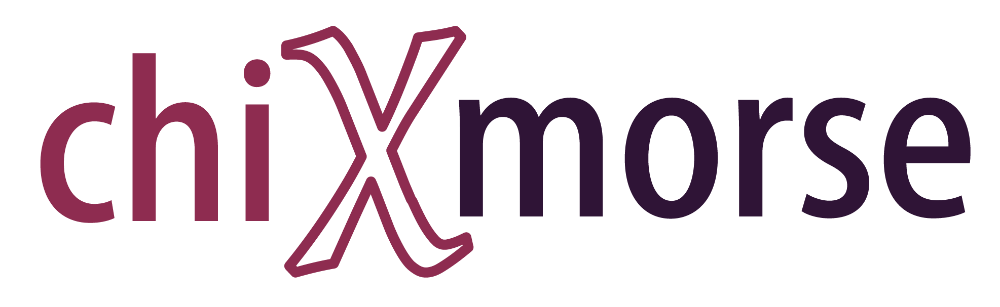
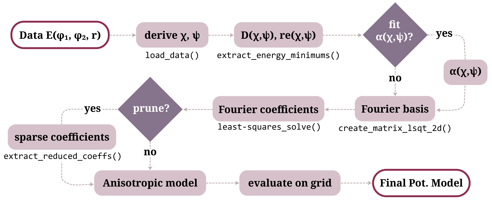

<p align="center">
  
</p>

<p align="center">
  Symmetry-constrained Fourier–Morse potential models for pair interactions in chiral molecules.
</p>

<p align="center">
  
  
</p>

---

## Overview

`chimorse` builds a continuous, analytic potential-energy model for the interaction between two chiral helices from tabulated **SCC-DFTB** reference data. The pair energy is described by an anisotropic Morse potential

$$
V(r;\chi,\psi) = D(\chi,\psi)\left[e^{-2\alpha(r-r_e)} - 2\,e^{-\alpha(r-r_e)}\right],
$$

where the well depth $D$, equilibrium distance $r_e$ (and optionally the width $\alpha$) vary with the relative orientation of the two helices. That orientation dependence is represented in a **symmetry-adapted Fourier basis** in the chiral coordinates

$$
\chi = \varphi_1 - h\,\varphi_2, \qquad \psi = \varphi_1 + h\,\varphi_2,
$$

with $h=\pm 1$ the screw direction. The symmetry of each interaction class fixes which Fourier terms survive, so the model stays compact.

Four interaction classes are handled, set by relative handedness (E/O) and relative direction (P/A):

| Class | Handedness | Direction      | $\chi$-symmetric |
|-------|------------|----------------|:----------------:|
| `EP`  | equal      | parallel       | yes              |
| `EA`  | equal      | antiparallel   | no               |
| `OP`  | opposite   | parallel       | yes              |
| `OA`  | opposite   | antiparallel   | no               |

---

## Method

From DFTB reference data to a fitted (optionally sparse) anisotropic Morse model:

<p align="center"></p>

---

## Installation

```bash
git clone https://github.com/hadis-gh/chimorse.git
cd chimorse

python uv venv .venv
source .venv/bin/activate          # Windows: .venv\Scripts\activate

python uv pip install chimorse -e .
```

The editable install (`-e`) means edits to the source are picked up after a kernel restart, with no reinstall needed.

---

## Quick start

```python
import matplotlib.pyplot as plt

from chimorse.config import MOLECULES, PLOT_PARAMS, get_colors
from chimorse.dataio import load_data
from chimorse.fitting import generate_fourier_morse_data
from chimorse.plotting import plot_parity, plot_energy_surfaces_chi_psi

plt.rcParams.update(PLOT_PARAMS)

molecule       = MOLECULES['PA']
interaction    = 'EP'
harmonic_ceils = {'EP': (8, 1), 'EA': (8, 1), 'OP': (20, 1), 'OA': (20, 1)}

# Reference data (see "Input data" below)
df = load_data(molecule, interaction, zero_zeta=True)

# Fit the anisotropic Morse model and evaluate it on the reference grid
df_model = generate_fourier_morse_data(
    df, molecule, interaction, harmonic_ceils,
    alpha_fit=False, original_size=True, print_errors=True,
)

# Compare model vs. reference
plot_parity(df, df_model, interaction, alpha_fit=False, compare_target='Emin')
plot_energy_surfaces_chi_psi(df, interaction, molecule.screw_step,
                             get_colors(), model_df=df_model, plot_type='difference')
```

For the sparse variant, pass `prune_model=True` with `prune_top_n` (or `prune_thresholds`); see notebook `05`.

---

## Package structure

```
src/chimorse/
├── config.py     # constants, colormaps, MoleculeInfo/MOLECULES, FigureContext
├── dataio.py     # load_data, expand_data
├── fourier.py    # χ–ψ Fourier design matrix, coefficient counting, RMSE
├── analysis.py   # symmetry ops, energy-minimum extraction, screw periodicity, error metrics
├── models.py     # 1D Morse/LJ, MorseAnisotropic(+Alpha), model evaluation
├── fitting.py    # 1D fits, α extraction, pruning, generate_fourier_morse_data
└── plotting.py   # energy surfaces, line cuts, convergence, parity, pruning figures
```

---

## Input data

`load_data` reads one tab-separated `.dat` file per interaction class, named `E_all_{interaction}.dat`, with five columns and no header:

```
phi1    phi2    z    r    e
```

It derives $\chi,\psi$ from $(\varphi_1,\varphi_2)$, shifts the energy by $-2\,E_\mathrm{ref}$ (from `MoleculeInfo.re_energy`), and — with `zero_zeta=True` — keeps the $z=0$ slice.

> **Note.** The data directory is currently set inside `load_data`. Point it at your own `E_all_*.dat` files (or add a small sample dataset under `chimorse/data/molecule_name`) before running the notebooks.

Molecule metadata (screw step, reference energy) lives in `MOLECULES` in `config.py`; add an entry there for a new system.

---

## Examples

Run the notebooks in order — each is self-contained and writes figures under `Figures/`:

| Notebook | What it does |
|----------|--------------|
| `01_raw_visualization.ipynb` | Inspect raw $E(r)$ curves, $E_\mathrm{min}(\chi,\psi)$ surfaces, and line cuts |
| `02_radial_fit_ER.ipynb`     | Fit 1D Morse vs. Lennard-Jones to $E(r)$ at a fixed orientation |
| `03_harmonic_convergence.ipynb` | Choose $(h_\chi, h_\psi)$ from RMSE convergence vs. harmonic order |
| `04_fourier_morse.ipynb`     | Build the full Fourier–Morse model and compare to reference |
| `05_pruned_fourier_morse.ipynb` | Prune coefficients to a sparse model and assess accuracy |

---

## Citation

If you use `chimorse`, please cite the accompanying paper:

```bibtex
...
```

---

## License

Released under the MIT License.

---

## Acknowledgements

This package was developed by Hadis Ghodrati as part of doctoral research at the Institut für Physik, TU Chemnitz, under the supervision of Dr. Jeffrey Kelling. 
Acknowledge funding by German Research Foundation (DFG), TRR-386, TP A4 and B2, project number 514664767. 

The SCC-DFTB reference data were kindly provided by Prof. Florian Günther (Departamento de Física, Universidade Estadual Paulista).
