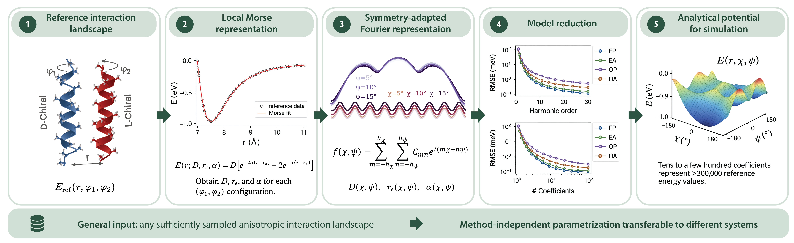
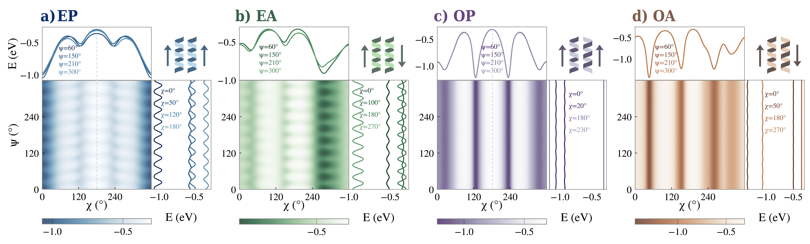
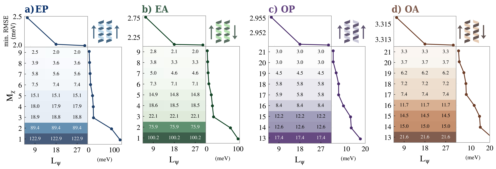

<p align="center">
  
</p>

<p align="center">
  <strong>From sampled anisotropic interaction data to compact analytical potentials.</strong>
</p>

<p align="center">
  
  
  
  
</p>

ChiMorse is a scientific Python toolkit for constructing compact analytical
representations of **sampled orientation-dependent pair interactions**. It
combines a radial Morse model with Fourier representations of the angular
dependence and provides tools for fitting, symmetry adaptation, convergence
analysis, coefficient pruning, validation, visualization, and export.

The current implementation uses one radial and two periodic orientational
coordinates. The accompanying α-polyalanine (αPA) system is a symmetry-rich
worked example rather than a restriction of the framework.

<p align="center">
  
</p>

<p align="center">
  <em>From sampled interaction data to a symmetry-adapted, validated, and
  optionally pruned analytical potential.</em>
</p>

## What ChiMorse does

| Stage | Capability |
|---|---|
| **Input** | Load sampled radial interaction profiles over periodic orientations. |
| **Parameterization** | Extract local Morse parameters and represent their angular dependence with two-dimensional Fourier expansions. |
| **Symmetry** | Restrict the Fourier basis using known periodicity and interchange symmetries when available. |
| **Model reduction** | Select harmonic resolution from convergence and prune weak coefficients. |
| **Validation** | Compare reconstructed parameters and energies against the reference landscape. |
| **Output** | Evaluate the analytical potential and export fitted coefficients for external simulation codes. |

ChiMorse is intended for cases where a densely sampled interaction landscape is
accurate but inconvenient to store, interpolate, or repeatedly evaluate in a
larger simulation workflow.

## Demonstration at a glance

The accompanying study demonstrates ChiMorse on four classes of rigid chiral
α-polyalanine helices. EP, EA, OP, and OA denote the combinations of
equal/opposite handedness and parallel/antiparallel axial alignment.

Each class contains roughly **300,000 sampled energy values**. For the compact
constant-$\alpha$ representation, symmetry adaptation reduces the model to
54–246 Fourier coefficients before pruning and 49–122 afterward. The unpruned
compact models reproduce near-equilibrium energies with RMSE values of about
**3.7–5.0 meV** within $2k_\mathrm{B}T$ at 300 K.

These application-specific results illustrate the accuracy–compactness
trade-off that ChiMorse is designed to quantify.

### Reference angular landscapes

The sampled well-depth field $D(\chi,\psi)$ reveals the orientational structure
that the analytical model must reproduce. In the αPA demonstration, the
strongest variation occurs along $\chi$, while $\psi$ adds a weaker
screw-periodic modulation.

<p align="center">
  
</p>

<p align="center">
  <em>Reference D(χ, ψ) landscapes and representative angular cuts for
  the four αPA interaction classes.</em>
</p>

### Harmonic convergence

Fourier resolution is selected systematically rather than fixed a priori. The
reconstruction RMSE is monitored as the retained harmonic orders are increased;
the chosen cutoffs lie near the onset of the error plateau, beyond which extra
harmonics provide little improvement.

<p align="center">
  
</p>

<p align="center">
  <em>Harmonic-convergence analysis for D(χ, ψ). The αPA landscapes require
  different resolution along χ, while the first symmetry-allowed ψ harmonic
  captures the dominant joint-phase dependence.</em>
</p>

### Controlled coefficient pruning

Once the harmonic basis is selected, ChiMorse can further reduce the model by
pruning weak Fourier coefficients. As the dominant terms are retained, the
reconstruction RMSE approaches a plateau, providing a practical criterion for
balancing accuracy against model size.

<p align="center">
  
</p>

<p align="center">
  <em>Magnitude-based coefficient pruning for the compact model. Models are
  retained near the onset of the RMSE plateau.</em>
</p>

## Installation

ChiMorse is currently installed from source:

```bash
git clone https://github.com/hadis-gh/chimorse.git
cd chimorse
python -m pip install .
```

The package requires **Python 3.9 or newer**. The current continuous-integration
test matrix covers **Python 3.9–3.12**.

For development and testing:

```bash
python -m pip install -e ".[test]"
pytest -q
```

To run the notebooks:

```bash
python -m pip install -e ".[examples]"
```

## Quick start

The reference αPA dataset is archived separately on Zenodo. ChiMorse can
download it on demand and reuse the local copy on later runs.

```python
from pathlib import Path

from chimorse.config import load_molecule_info
from chimorse.dataio import load_data
from chimorse.datasets import ensure_reference_data
from chimorse.fitting import generate_fourier_morse_data

# Download the reference data once.
data_dir = ensure_reference_data("PA", data_root=Path("data"))

# Read dataset metadata.
molecule = load_molecule_info(
    "PA",
    metadata_path=data_dir / "metadata.json",
)

# Load one interaction class.
interaction = "EP"
df = load_data(molecule, interaction, zero_zeta=True)

# Harmonic cutoffs selected from convergence analysis.
harmonic_ceils = {
    "EP": (8, 1),
    "EA": (8, 1),
    "OP": (20, 1),
    "OA": (20, 1),
}

# Fit the compact Fourier–Morse representation and
# evaluate it on the reference grid.
df_model = generate_fourier_morse_data(
    df,
    molecule,
    interaction,
    harmonic_ceils,
    alpha_fit=False,
    print_errors=True,
)
```

`df_model` contains the reconstructed interaction on the reference grid and can
be passed to the plotting and error-analysis utilities.

## Example workflows

The notebooks form a progressive workflow from reference-data inspection to
model construction and export.

| Notebook | Purpose |
|---|---|
| [`01_raw_visualization.ipynb`](examples/01_raw_visualization.ipynb) | Inspect radial profiles, angular interaction landscapes, and representative cuts. |
| [`02_radial_fit_ER.ipynb`](examples/02_radial_fit_ER.ipynb) | Compare Morse and Lennard–Jones fits for selected radial profiles. |
| [`03_harmonic_convergence.ipynb`](examples/03_harmonic_convergence.ipynb) | Measure reconstruction error as Fourier harmonic resolution is increased. |
| [`04_fourier_morse.ipynb`](examples/04_fourier_morse.ipynb) | Fit and evaluate the symmetry-adapted Fourier–Morse model. |
| [`05_pruned_fourier_morse.ipynb`](examples/05_pruned_fourier_morse.ipynb) | Explore the accuracy–compactness trade-off through coefficient pruning. |
| [`06_export_model_md.ipynb`](examples/06_export_model_md.ipynb) | Export fitted coefficients for an external molecular-dynamics implementation. |
| [`07_weight_functions.ipynb`](examples/07_weight_functions.ipynb) | Compare weighting functions used in orientation-resolved $\alpha$ fitting. |
| [`08_fourier_morse_fit.ipynb`](examples/08_fourier_morse_fit.ipynb) | Run a configurable Fourier–Morse fitting workflow with selectable weighting and interpolation. |

The notebooks are committed without outputs to keep them lightweight and
reproducible. The figures above provide representative results for readers who
want a quick view of the workflow without executing the examples.

## Using ChiMorse with another interaction dataset

ChiMorse operates on the sampled interaction landscape rather than on the
method used to generate it. Compatible reference data may therefore originate
from electronic-structure calculations, classical models, other simulation
methods, or other sources of tabulated pair interactions.

The **current high-level workflow is not an arbitrary N-dimensional fitter**.
It assumes one radial coordinate and two periodic orientational coordinates.
The built-in αPA loader expects a five-column, tab-separated table without a
header:

```text
phi1    phi2    zeta    r    pair_energy
```

`load_data()` constructs the collective coordinates $\chi$ and $\psi$ and
converts the pair energy to the binding-energy column used by the fitting
workflow.

For another molecular or particle system, users must provide compatible
metadata and data and choose angular coordinates, harmonic resolution, and
symmetry restrictions appropriate to that system. The αPA screw and
interchange symmetries are a worked example, not a universal prescription.

## Method in brief

For each orientational configuration, ChiMorse represents the radial
interaction using a Morse potential whose parameters may depend on the angular
coordinates:

$$
V(r;\chi,\psi)
=
D(\chi,\psi)
\left[
e^{-2\alpha(\chi,\psi)[r-r_e(\chi,\psi)]}
-
2e^{-\alpha(\chi,\psi)[r-r_e(\chi,\psi)]}
\right].
$$

For the current helical formulation, the collective coordinates are

$$
\chi = \varphi_1-h\varphi_2,
\qquad
\psi = \varphi_1+h\varphi_2,
$$

with $h=+1$ for equal-handed pairs and $h=-1$ for opposite-handed pairs.

The parameter fields $D$, $r_e$, and optionally $\alpha$ are represented by
truncated two-dimensional Fourier expansions. When known symmetries are
available, incompatible Fourier terms are excluded before fitting. Model
complexity is then controlled through harmonic selection and coefficient
pruning.

For the full derivation, symmetry relations, and validation, see the
accompanying scientific manuscript.

## Software engineering and reproducibility

The repository follows a reusable scientific-software layout:

```text
src/chimorse/       installable Python package
tests/              automated unit/integration tests
examples/           reproducible Jupyter workflows
docs/               Sphinx user and API documentation
.github/workflows/  continuous integration and documentation deployment
```

Reference data are archived separately from the source code, dataset downloads
can be validated using checksum metadata when available, and fitted analytical
models can be exported as JSON for use in external simulation implementations.

## Documentation

The rendered documentation is available at
[hadis-gh.github.io/chimorse](https://hadis-gh.github.io/chimorse/).

It includes installation and getting-started guides, the software-oriented
method description, reference-data guidance, example workflows, and an API
reference generated from the package docstrings.

To build the documentation locally:

```bash
python -m pip install -e ".[docs]"
python -m sphinx -W -b html docs docs/_build/html
```

## Reference data

The scientific reference data are kept outside the Git repository.

- **System:** α-polyalanine (`PA`)
- **Archive:** Zenodo
- **Version-specific DOI:** [`10.5281/zenodo.21904448`](https://doi.org/10.5281/zenodo.21904448)
- **Local layout after download:** `data/PA/`

For reproducible analyses, record both the ChiMorse software version and the
dataset DOI used to generate the results.

## Citation

Please cite the resources relevant to your use. The software, scientific
method, and reference dataset are identified separately.

### Software

The repository contains [`CITATION.cff`](CITATION.cff), which GitHub can use to
export the software citation metadata.

> Hadis Ghodrati and Jeffrey Kelling, **ChiMorse Python package**.  
> DOI: [`10.5281/zenodo.22071766`](https://doi.org/10.5281/zenodo.22071766)

### Scientific manuscript

If your work uses the Fourier–Morse methodology described in the accompanying
study, please also cite:

> Hadis Ghodrati, Sibylle Gemming, Florian Günther, and Jeffrey Kelling,  
> **“A Symmetry-Constrained Fourier–Morse Framework for Compact Anisotropic Interaction Potentials.”**  
> *Manuscript/preprint details will be added when publicly available.*

### Reference dataset

If you use the αPA reference data, please cite the corresponding Zenodo dataset
record:

> [`10.5281/zenodo.21904448`](https://doi.org/10.5281/zenodo.21904448)

## Contributing

Bug reports, reproducibility issues, and focused contributions are welcome.
See [`CONTRIBUTING.md`](CONTRIBUTING.md) for the current contribution
guidelines.

## License

ChiMorse is distributed under the
[GNU General Public License v3.0 or later](LICENSE).
