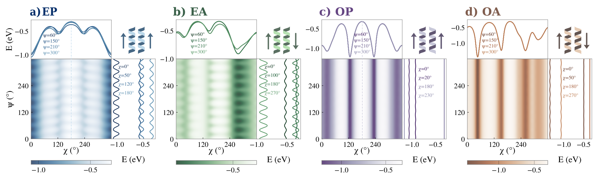
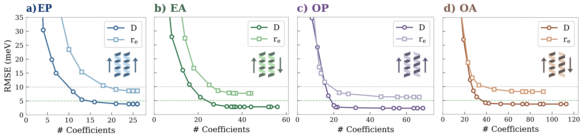

<p align="center">
  
</p>

<p align="center">
  <strong>From sampled anisotropic interaction data to compact analytical potentials.</strong>
</p>

<p align="center">
  
  
  
  
</p>

ChiMorse is a scientific Python toolkit for constructing compact analytical
representations of **sampled orientation-dependent pair interactions**. It
combines a radial Morse model with Fourier representations of the angular
dependence and provides an end-to-end workflow for fitting, symmetry
adaptation, convergence analysis, coefficient pruning, error analysis,
visualization, and export.

The current implementation targets pair-interaction landscapes described by
one intermolecular separation and two periodic orientational coordinates. The
accompanying α-polyalanine (αPA) dataset is a symmetry-rich worked example;
the fitting framework itself is not tied to the electronic-structure method
used to generate the reference energies.

<p align="center">
  
</p>

<p align="center">
  <em>ChiMorse workflow: sampled interaction data are converted into local Morse
  parameters, represented in a Fourier basis, optionally restricted by known
  symmetries, tested for harmonic convergence, reduced by coefficient pruning,
  and exported as an analytical model.</em>
</p>

## What ChiMorse does

| Stage | Capability |
|---|---|
| **Input** | Load sampled radial interaction profiles over periodic orientations. |
| **Radial model** | Extract local Morse parameters \(D\), \(r_e\), and optionally \(\alpha\). |
| **Angular model** | Fit the parameter fields with two-dimensional Fourier expansions. |
| **Physics constraints** | Restrict the basis using known periodicity and interchange symmetries. |
| **Model selection** | Quantify convergence with harmonic resolution and prune weak coefficients. |
| **Validation** | Compare reference and reconstructed energies with equilibrium and energy-window error metrics. |
| **Output** | Evaluate the analytical potential on arbitrary configurations and export coefficients for external simulation codes. |

This makes ChiMorse useful when a dense sampled interaction landscape is
accurate but inconvenient to store, interpolate, or evaluate repeatedly in a
larger simulation workflow.

## Demonstration at a glance

The accompanying study uses rigid chiral α-polyalanine helices as a demanding
demonstration of the workflow. Four interaction classes arise from the
combinations of relative handedness and axial alignment:

**EP** = equal-handed/parallel, **EA** = equal-handed/antiparallel,  
**OP** = opposite-handed/parallel, **OA** = opposite-handed/antiparallel.

These labels are specific to the αPA demonstration; they are not required by
the general fitting framework.

For each interaction class, the reference landscape contains roughly
**300,000 sampled energy values**. In the compact constant-\(\alpha\) model,
symmetry adaptation reduces the Fourier representation to 54–246 coefficients
before pruning and 49–122 retained coefficients after pruning. The
symmetry-adapted, unpruned compact models reproduce near-equilibrium energies
with RMSE values of approximately **3.7–5.0 meV** within \(2k_\mathrm{B}T\) at
300 K.

These numbers are application-specific rather than universal performance
guarantees; they illustrate the model-compression and accuracy trade-off that
ChiMorse is designed to quantify.

### Reference angular landscapes

The figure below shows the sampled well-depth field \(D(\chi,\psi)\) for all
four αPA interaction classes. The two-dimensional maps are accompanied by
representative line cuts along the collective angular coordinates:
\(\chi\) describes relative angular registry, while \(\psi\) describes the
joint angular phase. For this demonstration, the strongest angular
corrugation occurs mainly along \(\chi\), whereas \(\psi\) provides a weaker
screw-periodic modulation. These structured landscapes are the quantities that
the Fourier representation must reproduce compactly.

<p align="center">
  
</p>

<p align="center">
  <em>Reference angular interaction landscapes for EP, EA, OP, and OA.
  The heat maps show D(χ, ψ); the accompanying cuts make the dominant angular
  structure and symmetry-related features directly visible.</em>
</p>

### Controlled coefficient pruning

After the harmonic resolution has been selected, ChiMorse can further reduce
the representation by removing weak Fourier coefficients and refitting the
remaining terms. The curves below show the reconstruction RMSE as a function
of the number of retained symmetry-allowed coefficients for the compact model.
Once the dominant terms are included, the error approaches a plateau. The
retained model is therefore selected near the onset of this plateau, where
additional coefficients provide little improvement in reconstruction accuracy.

<p align="center">
  
</p>

<p align="center">
  <em>Magnitude-based pruning for the compact model. The plateau in
  reconstruction error provides a practical criterion for balancing model
  accuracy against the number of retained coefficients.</em>
</p>

## Installation

ChiMorse is currently installed from source:

```bash
git clone https://github.com/hadis-gh/chimorse.git
cd chimorse
python -m pip install -e .
```

The package requires **Python 3.9 or newer**. The current continuous-integration
test matrix covers **Python 3.9–3.12**.

For development and testing:

```bash
python -m pip install -e ".[test]"
pytest -q
```

To run the notebooks:

```bash
python -m pip install -e ".[examples]"
```

## Quick start

The reference αPA dataset is archived separately on Zenodo. ChiMorse can
download it on demand and reuse the local copy on later runs.

```python
from pathlib import Path

from chimorse.config import load_molecule_info
from chimorse.dataio import load_data
from chimorse.datasets import ensure_reference_data
from chimorse.fitting import generate_fourier_morse_data

# Download the reference data once.
data_dir = ensure_reference_data("PA", data_root=Path("data"))

# Read dataset metadata.
molecule = load_molecule_info(
    "PA",
    metadata_path=data_dir / "metadata.json",
)

# Load one interaction class.
interaction = "EP"
df = load_data(molecule, interaction, zero_zeta=True)

# Harmonic cutoffs selected from the convergence analysis.
harmonic_ceils = {
    "EP": (8, 1),
    "EA": (8, 1),
    "OP": (20, 1),
    "OA": (20, 1),
}

# Fit the Fourier–Morse representation and evaluate it
# on the reference grid.
df_model = generate_fourier_morse_data(
    df,
    molecule,
    interaction,
    harmonic_ceils,
    alpha_fit=False,
    print_errors=True,
)
```

`df_model` contains the reconstructed interaction on the reference grid and
can be passed directly to the plotting and error-analysis utilities.

The downloader and parser are deliberately separate:
`ensure_reference_data()` handles external acquisition, whereas `load_data()`
operates only on local files.

## Example workflows

The notebooks are organized as a progressive scientific workflow. The first
six form the main end-to-end path; the last two provide additional fitting
diagnostics and configuration options.

| Notebook | Purpose |
|---|---|
| [`01_raw_visualization.ipynb`](examples/01_raw_visualization.ipynb) | Inspect radial profiles, angular energy landscapes, and representative cuts. |
| [`02_radial_fit_ER.ipynb`](examples/02_radial_fit_ER.ipynb) | Compare Morse and Lennard–Jones fits for selected radial profiles. |
| [`03_harmonic_convergence.ipynb`](examples/03_harmonic_convergence.ipynb) | Measure reconstruction error as Fourier harmonic resolution is increased. |
| [`04_fourier_morse.ipynb`](examples/04_fourier_morse.ipynb) | Fit and evaluate the full symmetry-adapted Fourier–Morse model. |
| [`05_pruned_fourier_morse.ipynb`](examples/05_pruned_fourier_morse.ipynb) | Explore the accuracy–compactness trade-off through coefficient pruning. |
| [`06_export_model_md.ipynb`](examples/06_export_model_md.ipynb) | Export fitted coefficients for an external molecular-dynamics implementation. |
| [`07_weight_functions.ipynb`](examples/07_weight_functions.ipynb) | Compare weighting functions used in orientation-resolved \(\alpha\) fitting. |
| [`08_fourier_morse_fit.ipynb`](examples/08_fourier_morse_fit.ipynb) | Run a configurable Fourier–Morse fitting workflow with selectable weighting and interpolation. |

The notebooks are committed without outputs to keep them lightweight and
reproducible. The curated figures above therefore give readers a representative
view of the input landscapes and model-reduction behavior without requiring
them to execute the examples.

## Using ChiMorse with another interaction dataset

ChiMorse is independent of the method used to generate the reference
interaction energies: the sampled landscape may come from
electronic-structure calculations, a classical model, another simulation
method, or any other source that produces a compatible interaction table.

The **current high-level workflow is not an arbitrary N-dimensional fitter**.
It assumes the geometry implemented in the package: a radial coordinate plus
two periodic orientational coordinates. The built-in αPA loader expects a
five-column, tab-separated table without a header:

```text
phi1    phi2    zeta    r    pair_energy
```

`load_data()` constructs the collective coordinates \(\chi\) and \(\psi\) and
converts the pair energy to the binding-energy column used by the fitting
workflow.

For a different molecular or particle system, the user must supply compatible
metadata/data and choose angular coordinates, harmonic resolution, and symmetry
restrictions that are physically appropriate for that system. The αPA screw
and interchange symmetries are a worked example, not a universal prescription.

## Method in brief

For each orientational configuration, ChiMorse represents the radial
interaction as

\[
V(r;\chi,\psi)
= D(\chi,\psi)
\left[
e^{-2\alpha(\chi,\psi)[r-r_e(\chi,\psi)]}
-2e^{-\alpha(\chi,\psi)[r-r_e(\chi,\psi)]}
\right].
\]

The collective angular coordinates used in the current helical formulation are

\[
\chi = \varphi_1-h\varphi_2,
\qquad
\psi = \varphi_1+h\varphi_2,
\]

with \(h=\pm1\) determined by the relative screw direction. The parameter
fields \(D\), \(r_e\), and optionally \(\alpha\) are represented by truncated
two-dimensional Fourier expansions. Symmetry restrictions are applied at the
basis level before fitting, and model complexity can then be reduced through
harmonic selection and coefficient pruning.

For the full derivation, validation, and αPA symmetry relations, see the
accompanying scientific manuscript.

## Software engineering and reproducibility

The repository is structured as a reusable scientific-software project rather
than only as paper-supporting scripts:

```text
src/chimorse/       installable Python package
tests/              automated unit/integration tests
examples/           reproducible Jupyter workflows
docs/               Sphinx user and API documentation
.github/workflows/  continuous integration and documentation deployment
```

The workflow additionally separates source code from archived scientific data,
uses a version-specific Zenodo record for the reference dataset, validates
downloaded files when checksum metadata are available, and supports JSON export
of fitted analytical models for external simulation implementations.

## Documentation

The rendered documentation is available at
[hadis-gh.github.io/chimorse](https://hadis-gh.github.io/chimorse/).

It includes installation and getting-started guides, the software-oriented
method description, reference-data guidance, example workflows, and an API
reference generated from the package docstrings.

To build it locally:

```bash
python -m pip install -e ".[docs]"
python -m sphinx -W -b html docs docs/_build/html
```

## Reference data

The scientific reference data are kept outside the Git repository.

- **System:** α-polyalanine (`PA`)
- **Archive:** Zenodo
- **Version-specific DOI:** `10.5281/zenodo.21904448`
- **Local layout after download:** `data/PA/`

For a published analysis, record both the ChiMorse software release/version and
the dataset DOI used to generate the results.

## Citation

Please cite the resources relevant to your use: the software, the scientific
method/paper, and the reference dataset are intentionally identified
separately.

### Software

The repository contains [`CITATION.cff`](CITATION.cff). GitHub's
**Cite this repository** menu can export the software citation metadata.

The scientific manuscript currently cites the ChiMorse software record as:

> Hadis Ghodrati and Jeffrey Kelling, **ChiMorse Python package**.  
> DOI: `10.5281/zenodo.22071766`

### Scientific manuscript

If your work uses the Fourier–Morse methodology described in the accompanying
study, please also cite:

> Hadis Ghodrati, Sibylle Gemming, Florian Günther, and Jeffrey Kelling,  
> **“A Symmetry-Constrained Fourier–Morse Framework for Compact Anisotropic Interaction Potentials.”**  
> *Manuscript/preprint details will be added when publicly available.*

### Reference dataset

If you use the αPA reference data, please cite the Zenodo dataset record
associated with DOI `10.5281/zenodo.21904448`.

## Contributing

Bug reports, reproducibility issues, and focused contributions are welcome.
See [`CONTRIBUTING.md`](CONTRIBUTING.md) for the current contribution
guidelines.

## License

ChiMorse is distributed under the
[GNU General Public License v3.0 or later](LICENSE).