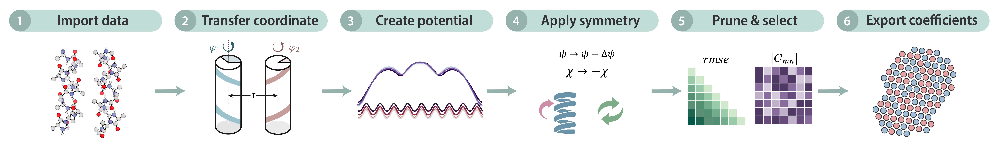

ChiMorse
========

**Compact, symmetry-constrained Fourier--Morse models for anisotropic pair interactions.**

ChiMorse converts sampled orientation-dependent pair-interaction energies into
compact analytical potentials. The radial dependence is represented by a Morse
potential and the orientational dependence of its parameters by
symmetry-adapted Fourier expansions. The package provides data acquisition and
loading, fitting, symmetry reduction, harmonic-convergence analysis,
coefficient pruning, model evaluation, plotting, and export utilities.

The reference workflow uses chiral alpha-polyalanine (alphaPA) helices as a
symmetry-rich demonstration system, but the representation is not tied to a
specific reference-data generation method.

Start here
----------

If you are new to ChiMorse, follow :doc:`installation` and then
:doc:`getting_started`. For the physical and mathematical construction, see
:doc:`method`. The reference dataset and the six worked notebooks are described
in :doc:`data_examples`.

.. toctree::
   :maxdepth: 2
   :caption: User guide

   installation
   getting_started
   method
   data_examples

.. toctree::
   :maxdepth: 2
   :caption: Reference

   api/index
   citing

Scope
-----

ChiMorse currently implements the two-dimensional surface-geometry workflow
used in the accompanying study. Applying it to a new system requires choosing
angular coordinates and symmetry restrictions that are physically appropriate
for that system; the alphaPA symmetry choices are an example rather than a
universal prescription.

The scientific methodology is described in the accompanying manuscript,
*“A Symmetry-Constrained Fourier--Morse Framework for Compact Anisotropic
Interaction Potentials in Surface Self-Assembly.”*
